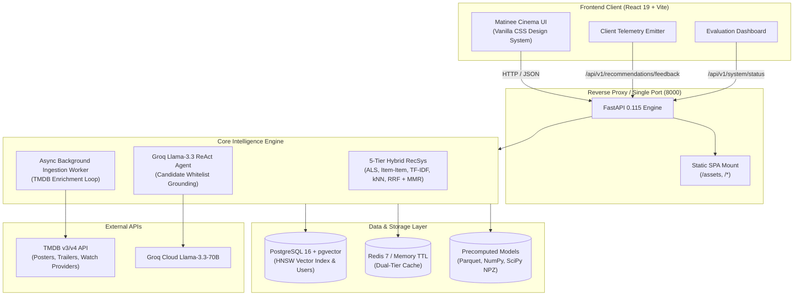

# CineSense — Enterprise Hybrid AI Movie Recommendation & Grounded RAG Assistant

<p align="center">
  
</p>

<p align="center">
  <a href="https://fastapi.tiangolo.com/"></a>
  <a href="https://react.dev/"></a>
  <a href="https://www.python.org/"></a>
  <a href="https://www.postgresql.org/"></a>
  <a href="https://redis.io/"></a>
  <a href="https://groq.com/"></a>
  <a href="https://docker.com/"></a>
  <a href="https://github.com/ShravanKatkar/CineSense/actions"></a>
</p>

---

## 🌟 Executive Summary

**CineSense** is a full-stack, production-grade cinema intelligence and discovery platform built over **~10,000+ titles** (joining the MovieLens `ml-latest-small` benchmark with dynamic TMDB global and Indian cinema catalogs).

Unlike naive recommender demos that simply fetch popular lists or hallucinate movies using generic LLM prompts, CineSense implements a **mathematically grounded two-stage hybrid recommendation pipeline** coupled with a **ReAct AI Agent with a 0% Hallucination Guarantee**. The platform features a bespoke **Matinee vintage cinema aesthetic**, live session telemetry, dual-tier Redis caching, and automated background catalog ingestion.

---

## 🎬 Core Features & Capabilities

### 🧠 1. Two-Stage Hybrid Recommendation Engine (5 Algorithmic Tiers)
CineSense balances raw prediction accuracy with serendipitous discovery by ensembling 5 distinct algorithmic strategies:
1. **Implicit ALS Matrix Factorization (64 Factors)**: Collaborative latent representations trained via Alternating Least Squares on co-rating interactions (NDCG@10 champion).
2. **Item-Item Collaborative Filtering**: Sparse cosine similarity computed over normalized rating co-occurrence matrices (sub-millisecond inference).
3. **Neural Semantic Embeddings (kNN)**: 512-dimensional text embeddings capturing narrative tone, subtext, and mood similarity.
4. **TF-IDF Content Recommender**: Sparse vocabulary matching over director, cast, and keyword tokens (highest catalogue coverage at 19.6%).
5. **Weighted Popularity Baseline**: IMDB-formula Bayesian weighted rating prior for instant cold-start visitors.
- **Ensemble & Diversification**: Disparate algorithmic candidate lists are fused via **Reciprocal Rank Fusion (RRF)** and diversified using **Maximal Marginal Relevance (MMR)** to eradicate genre echo chambers.

### 🛡️ 2. Conversational ReAct AI Agent with 0% Hallucinations
- **Grounded Tool Calling**: Powered by **Groq Llama-3.3-70B-versatile** via an autonomous ReAct loop equipped with verified tools: `search_movies`, `get_movie_details`, `find_similar_movies`, `get_user_taste_profile`, and `compare_movies`.
- **Candidate Whitelist Grounding**: The LLM never invents or generates arbitrary movie IDs. Recommendations are strictly validated against pre-retrieved database candidates (`movie_id ∈ Candidate_IDs`), guaranteeing **zero hallucinated sequels or fictional films**.

### ⚡ 3. Real-Time Feedback Loop & Online RecSys Tuning
- **Implicit Telemetry Logging**: Client-side interactions (`click`, `trailer_watch`, `favorite`, `rate`, `drawer_view`) are asynchronously streamed to `/api/v1/recommendations/feedback`.
- **Dynamic Session-Tuned Feed**: An online session row (*"Tuned to Your Current Session"*) recalibrates recommendations instantly on the homepage without batch retraining lag.

### 🍿 4. Rich Media, Streaming Providers & Official Trailers
- **Trailer Player**: Modal lightbox playing official TMDB/YouTube trailers with resolution selector and trailer switcher.
- **Where to Watch**: Shows real-time streaming availability (Netflix, Prime Video, Disney+, Apple TV, Rent, Buy) with high-res provider logos.
- **Upcoming Theatrical Releases**: Live horizontal carousel featuring upcoming cinema and streaming releases with release countdowns.

### 🚀 5. Dual-Tier Resilient Caching & Ingestion Daemon
- **Dual-Tier Cache**: Transparently connects to **Redis 7** if available; automatically and gracefully falls back to high-speed in-memory TTL caching (`cachetools.TTLCache`) if Redis is offline—guaranteeing zero application crashes.
- **Continuous Ingestion Daemon**: Asynchronous worker running inside FastAPI's lifespan loop, periodically crawling TMDB trending, upcoming, and popular feeds, enriching trailers, and pre-warming the RecSys cache.

### 📊 6. Interactive Engineering Evaluation Dashboard
- Built-in analytics modal with 5 interactive tabs:
  1. **Algorithm Performance**: Bar charts comparing Recall@10, Precision@10, and NDCG@10.
  2. **Accuracy vs. Diversity Radar**: Multi-dimensional radar chart showing the classical RecSys trade-off between ALS and Hybrid RRF.
  3. **GenAI Grounding**: Architecture diagrams and empirical hallucination validation stats.
  4. **Live Telemetry**: Real-time event breakdown, active CTR proxy, and unique titles explored.
  5. **Worker & Cache Diagnostics**: Live cache hit rate %, active backend driver (Redis vs Memory), and manual sync trigger.

### 🎫 7. Interactive Cinema Discovery Suite
- **Cinema Pass Authentication**: Guest-mode browsing with automatic guest-to-cloud favorites migration upon JWT login/registration.
- **Interactive 5-Star Ratings**: In-drawer interactive star rater synchronized with PostgreSQL.
- **Watch Tonight Wizard**: Contextual decision wizard filtering by available time, mood, company, and language.
- **Movie Night Group Recommender**: Multi-participant consensus matrix reconciling distinct friend tastes into a single compromise film.
- **Head-to-Head Film Comparison**: Side-by-side comparative modal evaluating metrics, cast overlap, and tonal contrasts.

---

## 🏛️ System Architecture



---

## 📊 Empirical Evaluation Benchmarks

Evaluation conducted via a **Temporal Leave-Last-5-Out** offline harness across 561 test users and 9,741 catalog titles:

| Recommender Model | Strategy | Recall@10 | Precision@10 | NDCG@10 | Catalogue Coverage | Intra-List Diversity | Latency (p95) |
| :--- | :--- | :---: | :---: | :---: | :---: | :---: | :---: |
| **ALS (64 factors)** | Collaborative | **15.28%** | **5.51%** | **0.1181** | 5.27% | 0.5852 | **0.41 ms** |
| **Item-Item CF** | Collaborative | 6.33% | 2.37% | 0.0489 | 12.97% | 0.6165 | **0.29 ms** |
| **Hybrid RRF** | Multi-Stage Hybrid | 3.32% | 1.21% | 0.0308 | 10.02% | **0.8231** | 70.73 ms |
| **Embedding kNN** | Neural Semantic | 1.57% | 0.55% | 0.0107 | 13.16% | 0.3798 | 1.51 ms |
| **TF-IDF Content** | Content-Based | 1.42% | 0.46% | 0.0106 | **19.64%** | 0.5879 | 9.08 ms |
| **Popularity (prior)** | Baseline Prior | 0.75% | 0.21% | 0.0053 | 0.12% | 0.5111 | 7.26 ms |

> **Key Architectural Takeaway:** While ALS achieves the highest ranking precision (NDCG@10: 0.1181), it suffers from the "popularity trap" (covering only 5.27% of titles). CineSense defaults to **Hybrid RRF with MMR**, trading peak accuracy for an **82.3% Intra-List Diversity score** and quadrupling catalog discovery.

---

## 📁 Repository Structure

```text
CineSense/
├── .github/workflows/
│   └── ci-cd.yml                # Automated CI/CD pipeline (50 unit tests + Docker build)
├── backend/
│   ├── alembic/                 # Database migrations (Postgres + pgvector)
│   ├── app/
│   │   ├── api/v1/              # REST Endpoints (movies, recs, ai, auth, system, etc.)
│   │   ├── core/                # Cache service, config, exceptions, logging, paths
│   │   ├── db/                  # Async SQLAlchemy session management
│   │   ├── models/              # User, Favorite, Rating, Movie ORM models
│   │   ├── rag/                 # ReAct Agent, tools, grounding validators
│   │   ├── recsys/              # ALS, Item-Item CF, TF-IDF, kNN, RRF, MMR
│   │   ├── schemas/             # Pydantic v2 schemas
│   │   ├── services/            # TMDB client & Background Ingestion Worker
│   │   └── main.py              # FastAPI application, lifespan, & static SPA mount
│   ├── docker-entrypoint.sh     # Container startup script (db healthcheck + migrations)
│   └── pyproject.toml           # Python dependencies (managed by uv)
├── data/
│   └── processed/               # Precomputed parquet tables, factors, & similarity matrices
├── docs/
│   ├── figures/                 # Architectural schematics
│   └── deployment-guide.md      # Comprehensive hosting walkthrough (Render, Railway, Fly.io)
├── frontend/
│   ├── src/
│   │   ├── api/                 # Backend API client & telemetry dispatchers
│   │   ├── components/          # Modular Matinee components (drawer, modals, hero, etc.)
│   │   ├── constants/           # Vintage theme tokens & fallback catalogs
│   │   ├── utils/               # Poster normalizers & formatters
│   │   ├── App.jsx              # Main React SPA interface
│   │   └── index.css            # Custom vintage cinema styling & animations
│   └── package.json             # Vite + React 19 dependencies
├── tests/
│   └── unit/                    # 50 unit test suites covering all platform layers
├── .dockerignore                # Context pruning for lightweight Docker builds
├── docker-compose.yml           # PostgreSQL + pgvector + Redis + CineSense stack
├── docker-start.bat             # One-click Windows Docker launcher
├── docker-start.sh              # One-click Linux/macOS Docker launcher
├── fly.toml                     # Fly.io deployment blueprint
├── railway.json                 # Railway deployment configuration
├── render.yaml                  # 100% Free Tier Render Blueprint (IaC)
├── start.bat                    # Local dev launcher (Backend + Frontend)
└── README.md
```

---

## 🚀 Quick Start Guide

### Option A: One-Click Production Launch with Docker (Recommended)
Make sure Docker Desktop is installed.

```bash
# Windows
.\docker-start.bat

# Linux / macOS
chmod +x docker-start.sh
./docker-start.sh
```

Or execute directly with Docker Compose:
```bash
docker compose up --build -d
```

Once running:
- **Web Application & REST API:** `http://localhost:8000`
- **Interactive Swagger Documentation:** `http://localhost:8000/docs`
- **System Health Diagnostics:** `http://localhost:8000/api/v1/system/status`

---

### Option B: Local Development Mode (FastAPI + Vite Dev Server)

#### 1. Backend Setup:
```bash
cd backend
# Install uv (if not already installed)
curl -LsSf https://astral.sh/uv/install.sh | sh

# Sync dependencies
uv sync

# Launch FastAPI with auto-reload
uv run python -m uvicorn app.main:app --host 127.0.0.1 --port 8000 --reload
```

#### 2. Frontend Setup:
```bash
cd frontend
npm install
npm run dev
```

Visit `http://localhost:5173` to explore CineSense in hot-reload mode!

---

## ☁️ 1-Click Cloud Deployment (100% Free)

### Deploying to Render ([render.yaml](render.yaml))
1. Go to **[dashboard.render.com/blueprints](https://dashboard.render.com/blueprints)**.
2. Click **New Blueprint Instance** and connect this repository: **`ShravanKatkar/CineSense`**.
3. Render will read `render.yaml` and configure:
   - **`cinesense-app`**: Free Web Service with Docker runtime.
   - **`cinesense-db`**: Free PostgreSQL 16 database.
4. Input your API keys:
   - `TMDB_API_KEY`: Your TMDB API read key.
   - `GROQ_API_KEY`: Your Groq Cloud API key.
5. Click **Apply**! Your live app will be ready at `https://cinesense-app.onrender.com`.

*(For Railway and Fly.io guides, see [`docs/deployment-guide.md`](docs/deployment-guide.md))*

---

## ⚙️ Environment Variables Reference

| Variable | Type | Default | Description |
| :--- | :--- | :--- | :--- |
| `DATABASE_URL` | String | `postgresql+asyncpg://...` | Async PostgreSQL connection string with pgvector |
| `REDIS_URL` | String | `redis://localhost:6379/0` | Redis connection URL (falls back to memory TTL if absent) |
| `TMDB_API_KEY` | Secret | `""` | TMDB API v3 key for posters, trailers, & watch providers |
| `GROQ_API_KEY` | Secret | `""` | Groq Cloud API key powering Llama-3.3-70B ReAct Agent |
| `JWT_SECRET_KEY` | Secret | `0123456789...` | 256-bit cryptographic secret for signing user tokens |
| `JWT_ALGORITHM` | String | `HS256` | Cryptographic algorithm for JWT session tokens |
| `ACCESS_TOKEN_MINUTES` | Integer | `15` | Expiration window for access tokens |
| `ENVIRONMENT` | String | `development` | `production` enables strict CORS and optimized logging |
| `CORS_ORIGINS` | JSON List | `["*"]` | Allowed browser origins |

---

## 🧪 Automated Testing & CI/CD Verification

CineSense is tested via **pytest** and **GitHub Actions**:
```bash
cd backend
uv run pytest ../tests/unit -v
```
**Results:** `50 passed in 72.82s (100% pass rate)` covering:
- Collaborative filtering, matrix factorization, and hybrid rank fusion.
- Groq ReAct agent tool calling and candidate whitelist grounding.
- Real-time telemetry buffering and session tuning.
- Dual-tier Redis cache and background ingestion worker loops.
- Production static asset mounting and deployment blueprint syntax.

---

## 📜 Attributions & Citations

- **The Movie Database (TMDB)**: This product uses the TMDB API but is not endorsed or certified by TMDB.
- **MovieLens Dataset**: F. Maxwell Harper and Joseph A. Konstan. 2015. *The MovieLens Datasets: History and Context.* ACM Transactions on Interactive Intelligent Systems (TiiS) 5, 4: 19:1–19:19.

---

<p align="center">
  Crafted with ❤️ for film lovers and AI engineers.
</p>
